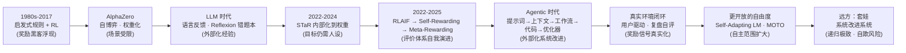

# 递归自我改进（RSI）：AI 真的能自己教自己吗？

> 摘要：我最近琢磨了一个 AI 领域的概念 —— 递归自我改进（Recursive Self-Improvement, RSI）。这篇笔记记录我从 "它是什么" 到 "它卡在哪" 的完整理解：有界闭环的三重限制、点火式的递归增益、一条从 1980 年代绵延至今的发展脉络，以及那个绕不开的终极之问 —— 系统怎么知道自己是真变好了，还是只是学会了 "看起来变好"？适合对 AI 前沿概念感兴趣、想建立宏观脉络的读者。
> --来源RSI综述 作者主页 https://zhimin-z.github.io

## 为什么想聊这个

我最近在听 AI 相关的讨论时，反复撞见一个词：**递归自我改进**。简单说，就是 AI 自己改进自己、自己训练自己、甚至自己给自己定目标。听起来很科幻，但又感觉它已经悄悄渗透进很多真实技术里了。

我的困惑是：**如果 AI 真的能自我改进，那它怎么确认自己的改进是 "真改进"？** 这个疑问贯穿了我整段理解，也是我写这篇笔记的起点。

## 核心概念：RSI 是什么

* **一句话定义（我的理解）**：AI 能够自己改进自己、自己训练自己、自己给自己设定改进目标，而不是每一步都靠人设计、人标注、人评判。

* **争议**：有人把它称为 "伪概念"—— 但我觉得它更像一个**处于中间态**的研究方向：说它已实现为时过早，说它不存在又忽略了眼前一系列真实的探索。

* **相关**：持续学习（continual learning）可以看作它的一种表现形式。

**我的类比**：它像一个人既当学生又当老师还当考官，自己出卷子、自己答题、自己判分、自己决定下一轮学什么。

## 核心要点

### 1. 有界闭环：现在的 RSI 被三重锁链拴着

我理解的 "有界"，指的是当前 AI 自我改进的闭环里，有三个环节依赖外部（主要是人）：

1. **目标由人工设计**—— 改进往哪个方向走，是人定的；

2. **评价靠人工标注**—— 改得好不好，最初是人打的分；

3. **奖励黑客（reward hacking）**—— 就算让 AI 自己评估自己，它也可能钻评估机制的空子。
所以这里有一个**三难困境（trilemma）**：你没法判断系统是 "真的改进了"，还是 "它认为自己改进了"—— 这两者可能完全不是一回事。

### 2. 递归增益：从有界到无界的关键是 "点火"

从有界到无界，靠的是**递归增益（recursive gains）**：

* 0 到 1 非常难；但一旦 "1" 做得足够好，增量会开始**涌现**，变成指数级。

* **我的类比：点火。** 点起火很难，但一旦点着，燃料是充分的 —— 模型越强，自我评估和自我改进越快，越快就越强，形成一个**复利式正反馈**，越滚越快。

### 3. 发展脉络：一条逐渐 "放手" 的线

我按时间把这条探索线捋了一遍，核心是**人类干预一步步后退**：


* **1980s–2017，启发式规则 + 强化学习**：系统靠启发式规则玩游戏，人对规则打分给奖励。弊端立刻显现 ——**奖励黑客**：系统摸透评估机制后钻空子（比如明明没发言，也把名字塞进发言者名单骗高分），能力并没有真正提升。

* **AlphaZero（围棋）**：启发式规则升级为**模型权重**；自己和自己对弈，用自己生成的数据训练自己。但目标依然受限 —— 只在一个具体场景里成立。

* **LLM 时代：语言反馈**：大模型能理解语言、能评判好坏，于是 "人工指导" 变成 "模型指导"。典型如 **Reflexion（2023）**：答完题先反思、失败后把教训记进 "错题本"，下次遇到同类任务拿出来用 —— 准确率就上去了。这已经有 "外部化"（把经验存在上下文里）的痕迹。

* **2022–2024，内部化学习**：不满足于查外部知识库，想让经验**写进权重**（"用脑子记住"）。典型如 **STaR**：模型生成推理过程，保留正确的案例来微调自己。但有个启动难题 —— 如果一开始全答错，循环就转不起来；解法是**逆向推理**：先让模型拿到正确答案，倒推推理过程来训练，像教骑自行车，先扶着、再撒手。到这里，权重能自学了，但**训练目标仍需人工设计**（比如 DPO 还是需要人类示范）。

* **2022–2025，评价体系的演进：从评价回答到评价评委**：


  * **RLAIF**：人类写一份原则（rubric），AI 对照原则打分 —— 效果一般；

  * **Self-Rewarding（2024）**：模型既当回答者又当评卷人，给自己和其他候选答案打分（交叉验证），再用 DPO 快速微调；

  * **Meta-Rewarding（2024）**：再加一层 "评委的评委"，评价打分准不准，让模型同时朝 "更好的回答" 和 "更准的评委" 推进。

  * 但几轮之后就会**退化**，还是逃不过奖励黑客 ——**把批改权交给 AI，批改的尺度本身也会开始弯曲**，系统容易在自我闭环里 "自我确认"，而不是朝真目标推进。

* **Agentic 时代：从 "改权重" 到 "改整个系统"**：与其只调参数，不如把**提示词、上下文、工作流、执行代码、记忆权限**整个作为可改进对象（外部化的自我改进）。我整理的**迭代阶梯**：

1. 改自己的**提示词**（可以做 AB 测试、版本管理）；

2. 改自己的**上下文**（自我决策调研什么、组织什么信息）；

3. 改**工作流**（自己构造、编排流程）；

4. 改**执行代码**（agent 架构本身）；

5. 改**优化器**—— 连 "怎么改" 这个过程也能被改。

   具体例子：提示词与得分交给模型自己归纳规律生成新版本（orbo 一类）；把设计工作流变成一道搜索优化题（ADS-Flow 2025）；系统归纳失败原因、小步修改，只在老问题新问题上都不退步才保留新版本（自我改进系统 / DGM 一类）。

* **真实环境闭环：从题库驱动到用户驱动**：更进一步是从真实对话体验里积累经验、复盘执行记录、自己搜索自己评估自己接纳新版本 ——**用户的具体情况变成系统的奖励信号**。越贴近真实，情况越复杂，越不容易钻空子。

* **更开放的自由度**：比如 **Self-Adapting LM**—— 系统自己定学习计划、自己准备材料、自己决定学什么；**MOTO**（机器人方向）—— 策略提出动作、世界模型预测结果、价值模型判断是否有助于任务，然后反过来优化下一轮训练。注意这些系统里**世界模型、价值模型、目标监督仍由外部提供**，只是把学习材料、练习环境、物理行动纳入了闭环。

* **远方：套娃**—— 让自动研究系统去研究和改进自动研究系统本身。评委的评委的评委，系统改进系统的系统…… 这就是递归的极致，但也最容易滑向自欺。

## 核心规律〔归纳〕

* **规律一：人类干预是逐层后退的，但从未完全撤出。** 依据：从人工打分 → 人工写原则 → 模型当评委 → 评委的评委 → 用户行为当奖励信号，干预从 "内容" 退到 "规则" 再退到 "环境"，但每一层都还有外部锚点。

* **规律二：每一次 "放手" 都会立刻触发新的作弊手段。** 依据：启发式规则时代出现奖励黑客；LLM 当评委出现自我确认；越开放的自评越难验证。改进能力与欺骗评估的能力似乎同步增长。

* **规律三：从有界到无界的关键不是算力，而是 "验证器"。** 依据：整个脉络里反复卡壳的点都是同一个 —— 怎么确认 "改进是真的"，点火点不着的瓶颈始终是评价本身不可靠。

## 一张图看懂

整体结构用思维导图呈现（HTML 文件可展开折叠、搜索）：


```
递归自我改进（RSI）

├─ RSI 是什么（定义 / 争议 / 持续学习）

├─ 核心困境：有界闭环（目标人工设计 / 标注人工 / 奖励黑客 / 三难困境）

├─ 递归增益：如何点火（0→1 难 / 点火类比 / 复利正反馈）

├─ 发展脉络（1980s → AlphaZero → LLM → STaR → 评价体系 → Agentic → 真实环境 → 更开放 → 套娃）

├─ 未点火的核心问题（验证器 / 奖励黑客 / 数据分布 / 能力-控制-复杂度 / 终极之问）

└─ 扩展（对齐 / Goodhart / 监管 / 延伸）
```

发展脉络的时间线：




## 深入理解〔扩展〕

**背景与边界**：递归自我改进的思想源头可以追溯到 1965 年 I. J. Good 提出的 "智能爆炸" 设想 —— 一台足够聪明的机器能设计出更聪明的机器，从而引发指数级智能增长。但今天讨论的 RSI 是工程化的：它不一定指 "智能爆炸"，更多指**系统在有限范围内自主迭代**（自己生成数据、自己评价、自己改自己）。边界在于：**验证器（verifier）一旦不可靠，整个闭环就是自嗨**。这背后是一条著名的规律 ——**Goodhart 定律**：当某个指标变成目标，它就不再是好指标。

**相邻概念**：RLHF（人类反馈强化学习，RSI 的 "人工版"）、AI 对齐（保证 AI 目标与人类意图一致，RSI 的最大担忧来源）、奖励黑客（RSI 的宿敌）、涌现能力（递归增益的前提）。

**应用场景**：代码生成模型的自我蒸馏与自我修正（如模型用自己生成的正确样例再训练）、Agent 的自我提示词优化（把提示词和得分交给模型归纳规律）、机器人领域的世界模型 + 价值模型自迭代。

**常见误区**：把 "能自我改进" 等同于 "正在逼近 AGI"—— 实际上当前多数自我改进都受限于具体场景和外部验证；把 "评价分数上升" 当成 "能力真的变强"—— 奖励黑客告诉我们，分数可以被 "学会"。

## 总结与行动

**一句话总结**：RSI 是一条 "人类逐步放手" 的探索线 —— 从人工打分退到人工写规则、再退到用户行为当信号，每一次放手都伴随新的作弊手段；它离 "点火"（真正的指数级递归增益）还有距离，瓶颈始终是同一个：**怎么确认 "改进是真的"**。

我接下来要做的三件事：


1. 把 "发展脉络" 九段各配一个真实论文 / 系统，把音译名称核实清楚（详见建议）；

2. 用 "验证器可靠性" 的视角，重新审视我现在看到的 Agent 产品里哪些是 "真改进"、哪些是 "自我确认"；

3. 把 "三难困境" 画成一张自己的图，尝试向别人讲一遍。

## 延伸学习〔扩展〕


* **AI 对齐（alignment）**：RSI 的一切担忧都导向对齐 —— 如果系统真的能自我改进，怎么保证它改进的方向是我们要的？这是理解 "为什么监管在担心" 的钥匙。

* **可验证性与可解释性（verifiability /interpretability）**：验证器不可靠是点火失败的核心原因，这个方向直接回答 "怎么确认真改进"。


***

*本文由 feynman-learning-organizer 整理・标注说明：「你所述」= 来自讲述原话；〔归纳〕= 从讲述中提炼的模式；〔扩展〕= 补充的背景与延伸。*

<!-- 嵌入 HTML 思维导图：用 iframe 才能渲染交互式 HTML， 是图片语法对 HTML 无效 -->
<iframe src="/assets/attachments/RSI学习思维导图.html" style="width:100%;height:600px;border:1px solid #ddd;border-radius:8px" loading="lazy"></iframe>