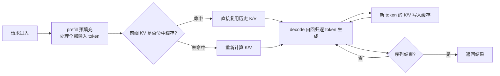
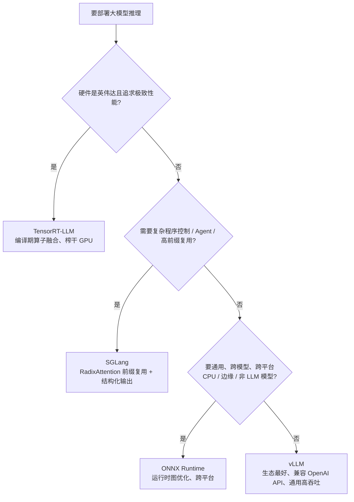

# 《大模型推理引擎怎么选？》

> 摘要：以 AI 工程师的视角，把大模型推理这件事拆成 "为什么难 → 引擎怎么解 → 四个引擎怎么选"。核心结论：vLLM 胜在生态与通用高吞吐，SGLang 胜在前缀复用与 Agent 复杂程序，TensorRT-LLM 胜在英伟达上的极致性能，ONNX Runtime 胜在通用跨平台。适合准备做部署 / 推理优化（FDE、推理引擎工程师）的同学。

## 为什么想聊这个

我想理清一件事：作为 AI 工程师，算法层面除了预训练、后训练，推理这一块到底要覆盖什么？尤其如果我做**前沿部署工程师（FDE）**，会遇到把模型离线部署到生产环境的情况 —— 一些公司还需要部署自己的模型。那么主流推理引擎 vLLM、SGLang、TensorRT-LLM（还有 ONNX Runtime 这类轻量的）到底各自解决什么问题、什么时候选谁？

我给自己定的理解框架是五问：**what（是什么）→ why（为什么出现、解决什么问题）→ how（怎么做）→ where（什么场景用）→ diff（彼此区别与选型理由）**。这篇笔记就是按这个框架写的。

## 核心概念：AI 工程师的算法层地图

先说覆盖面。AI 工程师大体分几层：
* **算法工程师（做过算法的那一层）**：覆盖预训练、后训练、甚至推理优化，对应算子工程师、推理算法工程师、模型算法工程师这些角色。
* **AI 应用工程师**：最基础的是先能把模型推理跑起来，再基于推理结果搭建 AI 应用。
* **FDE（前沿部署工程师）**：在工程里更关注**业务翻译**—— 把业务需求翻译成技术需求，精准定位缺口，真实走一遍流程，找到真正的增量点，把小而准的点提出来做**小范围验证**，验证成功后再**大规模推广**，之后还要关注整体迭代和数据飞轮。

## 核心要点

**要点 1：推理阶段有四大挑战，这是所有引擎存在的理由。**
1. **显存瓶颈**：模型参数太大 → 显存占用高 → 留给输入 embedding /token 的空间就少。
2. **吞吐与延迟的矛盾**：高并发下响应速度很难兼得。经典的 "削峰填谷"—— 削了峰、填了谷，但整体速度还是排着队来的，所以并发与响应之间有一个 tradeoff 要关注。
3. **成本压力**：算力资源昂贵、利用率低。关键问题是：有算力有显存，怎么把利用率提上去。
4. **碎片化与空闲**：显存碎片化严重不严重、GPU 利用率是不是一直拉满、有没有空闲阶段。

**要点 2：大模型推理的基本流程 = prefill + decode。**
* **prefill**：处理所有输入 token，一次性把输入算完。
* **decode**：自回归地逐个生成新 token。

**要点 3：KV Cache 的本质是 "遇事不绝，加缓存"。**
Transformer 架构里，每个 token 的 QKV 要和前面所有 token 做交互；下一个 token 又依赖前面所有 token，于是存在大量重复计算。而**前缀**（比如 system prompt）每次都一模一样，完全可以把算过的历史 K/V 存起来，命中就直接取用，不用重算。当然，没命中缓存的那些 K/V 还是要重新算出来再交互。

**要点 4：老式固定长度缓存的两个死穴 = 内部碎片 + 外部碎片。**
原来的 PyTorch 实现是固定长度、固定分配：
* 预设长度**太短**：输入 token 一多，缓存就不够用 → 命中率低、频繁交换。
* 预设长度**过长**：产生内部碎片；batch 与序列长度不成比例时，一个 batch 一个 batch 往里塞，还会产生外部碎片。
这本质上是 "**物理地址过于连续**" 的问题 —— 就像数据结构里从数组跳到链表：链表每个节点都有引用地址，物理地址可以随便放，不用挤在一段连续空间里。
碎片规律（你我的观察）：**高并发 + 短序列** → 内部碎片多；**低并发 + 长序列** → 内部碎片低。

**要点 5：大模型推理的三个核心指标。**
* 吞吐量：每秒输出多少 token；
* TTFT：首 token 延迟（Time To First Token）；
* TPOT：每个 token 的延迟（Time Per Output Token）。

## 核心规律〔归纳〕
1. **缓存的本质是消除重复计算**：KV Cache 不是新发明，是 "把历史计算结果存起来" 这一通用思想的落地；凡是前缀稳定（system prompt、公共文件头）的场景，缓存都有效。
2. **碎片化的根源是 "静态 + 连续"**：解决方向永远是 "动态 + 虚拟化"——vLLM 的 PagedAttention 直接借用了操作系统虚拟页管理的思想（逻辑页 → 动态物理地址），和 "数组跳链表" 是同一个思路。
3. **批处理效率的矛盾在 "等待最慢者"**：静态批处理必须等整个 batch 算完才统一返回；Continuous Batching 改成流式、动态补位，本质是让 GPU 不空等。
4. **引擎演化的主线是 "省显存 → 省算力 → 榨干算力"**：PagedAttention（消除碎片、省显存）→ Continuous Batching（动态调度、提利用率）→ RadixAttention（前缀复用、省重复计算）→ TensorRT 编译期算子融合（榨干 GPU）。
5. **选型永远看四维：场景 × 硬件 × 生态 × 团队能力**，没有 "哪个引擎最好"，只有 "哪个场景最适合"。
6. **部署工作的方法论**：翻译业务 → 定位缺口 → 真实走一遍 → 小范围验证 → 大规模推广 → 数据飞轮迭代。

## 一张图看懂
思维导图（可折叠、可搜索）已单独交付 HTML 文件。下面是两个关键的流程 / 选型图：
**推理两阶段与 KV Cache：**

**引擎选型决策：**

**四引擎一页对比：**

| 维度   | vLLM                               | SGLang             | TensorRT-LLM | ONNX Runtime         |
| ---- | ---------------------------------- | ------------------ | ------------ | -------------------- |
| 核心卖点 | 生态 + 通用高吞吐                         | 前缀复用 + 复杂程序        | 极致性能         | 通用跨平台                |
| 关键技术 | PagedAttention、Continuous Batching | RadixAttention、DSL | AOT 编译、算子融合  | 运行时图优化               |
| 最佳场景 | 默认选择、迁移成本低                         | Agent、多轮对话、编码      | 英伟达卡 + 极致性能  | CPU / NPU / 边缘 / 多模型 |
| 上手难度 | 低（兼容 OpenAI API）                   | 中                  | 高            | 中                    |

## 深入理解：四个引擎分别怎么想的〔扩展〕

**vLLM —— 生态最广的先行者（第一个吃螃蟹的人）**
它做了两件奠基性的事：

1. **PagedAttention（分页注意力）**：仿照操作系统的虚拟内存机制，把 KV cache 切成固定大小的 block，按 "逻辑页" 分配，物理地址动态放置。请求进来后 KV cache 被切分成固定 block 存在不同页里，实际存储位置是动态的；memory management 在请求真正生成 token 时才分配新 block（显存利用率超过 90% 时才分配）。效果：不用预先分配一段连续物理地址，显存碎片被消除、显存利用率上去、吞吐也跟着上去。

2. **Continuous Batching（连续批处理）**：原来是静态 batch—— 一个 batch 里所有序列都算完才统一返回；现在改成动态的：每个请求的 token 逐个流出，调度器**每个迭代**重新评估哪些请求能进当前 batch，用贪心策略保证已生成的 token 立即进入排区；一个请求完成就立刻移除，新请求在下一个迭代补位。GPU 一直处于高负载，不用空等，解决的是 "阻塞和等待浪费" 问题。
它出现得早、社区生态最好，而且**兼容 OpenAI API**—— 老流程迁移过来可以完全复用。

**SGLang —— 前缀复用的极致派**
vLLM 擅长单轮高吞吐，但对多步推理、分支、约束解码这类复杂程序不够灵活，且缓存利用率没有 "跨越式" 提升（它更多是在机制上消除显存浪费）。SGLang 在 "缓存命中率" 上再进一步：
* **RadixAttention**：名字就像 radix tree（前缀树）—— 用树结构存前缀 KV 缓存，实现前缀的高效复用（我猜的实现思路）。
* **DSL**：提供一种语言，允许用户用代码描述生成流程。
适用场景：多轮对话（system prompt 一模一样）、编码（每次打开的文件前缀都差不多）、Agent 工具调用（**原生支持结构化输出**）。性能分水岭：**前缀重复度越高，SGLang 比 vLLM 快得越多**；前缀重叠率很低时，两者吞吐差不多，无论并发多高。
**TensorRT-LLM —— 英伟达上的榨干派**
它换了一个维度：**编译期优化（AOT）**，深度绑定英伟达 GPU。把模型里的卷积、attention、transformer 等算子做算子级优化与融合、合并加速，显著提升 GPU 利用率。如果你的卡是英伟达、追求极致性能，用它。
**ONNX Runtime —— 通用派**
设计初衷是通用：底层是运行时图优化；支持 CPU、GPU、NPU 各种硬件平台，模型上也兼容非大模型场景。想跑视觉模型 + 大语言模型混合部署、或者边缘设备，用它。
**vLLM 2026 年的新动向（前沿快讯）**
* Prefix Caching v2：自动识别共享前缀，缓存命中率提升 45%；
* Chunked Prefill：预填充与解码交错执行，减少解码阻塞；
* Multi-LoRA Serving：动态加载多个 LoRA 适配器；
* RadixAttention：基于 radix tree 的 KV 复用，多请求共享前缀，多轮吞吐提升 3\~5 倍。
这些更偏**推理引擎工程师**的活 —— 他们一般面向内部（加速模型迭代）或对外（卖推理服务）；而我们做 FDE 或其他部署类工作，只需要会用这些引擎，把模型部署到内部或外部即可。
## 总结与行动
一句话总结：**推理引擎的进化史 = 显存不够用就做虚拟化（PagedAttention），吞吐上不去就做动态调度（Continuous Batching），缓存命中低就做前缀复用（RadixAttention），最后在特定硬件上做编译期榨干（TensorRT）—— 选型就看场景、硬件、生态、团队能力四件事。**

我接下来要做的：
1. 用 vLLM 本地起一个推理服务，实测 TTFT / TPOT / 吞吐三个指标，把 "指标" 和 "现象" 对上；
2. 构造一个高前缀重复的场景（多轮对话），分别用 vLLM 和 SGLang 跑一遍，验证 "前缀复用分水岭"；
3. 把 FDE 的方法论（翻译业务 → 小范围验证 → 大规模推广）套到下一个部署任务里走一遍。
## 延伸学习〔扩展〕
下一步最值得先学 **Chunked Prefill 与投机解码（Speculative Decoding）**：前者解决 "prefill 阻塞 decode" 的调度问题，后者用草稿模型 + 验证的方式进一步压 TTFT 和 TPOT—— 它们是 "吞吐和延迟矛盾" 这条主线上最新的解法。其次是 **KV Cache 量化（如 INT8/FP8）**，理解显存瓶颈在工程上的最后一块拼图。

---

<!-- 嵌入 HTML 思维导图：用 iframe 才能渲染交互式 HTML， 是图片语法对 HTML 无效 -->
<iframe src="/assets/attachments/大模型推理引擎-费曼梳理-思维导图.html" style="width:100%;height:600px;border:1px solid #ddd;border-radius:8px" loading="lazy"></iframe>