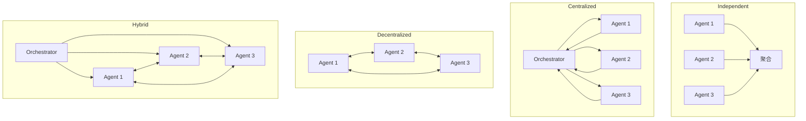

## 前言文章

### 证明什么
做了 260 个受控配置，横跨 6 个基准、5 种架构、3 个模型家族，把可能影响结果的变量都控制住。他们得出的结论是，多智能体的效果不取决于你用了多先进的模型，而取决于任务结构适不适合分工协作。
下图展示不同家族不同智能模式使用单智能体和多智能体系统的性能差异
他们把这套判断方法整理成了三条可查询的判据和一个贯穿约束。 以前「什么时候该用多智能体」「用哪种架构」是凭经验的启发式说法，这篇论文把它换成了能算的预测模型。输入任务特征和模型能力，就能算出该用哪种架构。
## What · 是什么
- 一句话定义：`Mulit-Agent` 是多智能体协作完成任务
- 核心要素有哪些？协作方式、适用场景、成本考量、安全可控。
	- 协作方式
		- 一般而言，包括前面的学习，会分为流水线形式、组织规划形式、p2p自由通信模式
		- 即流程非常固定的流水线，自由度最低，成本最可控；再到有组织者负责组织任务分发委派的形式，这个自由度中等，成本中等可控；再到自由通信，自由度最高，成本最不可控。
	- 适用场景中什么时候该用多智能体，其主要其一是单智能体能否完成较好，也没超过单智能体上下文限制，任务是否适合独立拆分。
- 到这篇文献中也差不多，他指出三类任务的分法
	- 规划任务：比如3D环境里合成物品，查配方等都是固定的步骤，工具少单智能体效果已经不错，搭配skill也很好。
	- 分析任务：给公司财务尽调，要考虑很多因素，单智能体效果会差，工具较多，适合拆分，还需要有一个节点组织和汇总。这里用Centralized架构。或者说是中心化编排。
		- 
	- 工具密集任务：工具多，可并行维度多，可用Decentralized架构，智能体之间直接通信，互相质询，这个自由度广，适合开放探索的任务，比如艺术创作，材料调研分析。
		- 
	- 那么该如何选取协作模式，看下图，其实大眼一看，对于不同任务，多智能体协作模式确有差异，从全局视角看，几乎都会降低性能，微观看不同协作模式造成的性能影响还不小。
	-
此外，他们列举除了更多形式的协作模式，注意他们所在意和拆分的维度是层级和通信。
下图中Independent 只有并行没有通信；Decentralized 只有通信没有层级；Centralized 只有层级没有横向；Hybrid 两者都有。SAS 作为基线，用来衡量多智能体到底带来多少收益。

四种架构的通信与层级对比：

Independent 三个智能体并行无通信，通信开销为 0，LLM 调用次数是 O(nk)，代价最低但收益也最低。Centralized 有 orchestrator 做层级协调，通信开销 O(r·n)，在聚合前插入验证。Decentralized 没有中央节点，智能体之间 sequential debate，通信开销 O(d·n)，并行度最高。Hybrid 是层级加横向灵活性的组合，通信开销 O(r·n+p·m)，最复杂也成本最高。
### 最后得出什么？到底什么时候适合用？
在那些实验指标下看，在单智能体拿到大部分分数的时候，剩余空间优先，协调开销也是实打实的，所以需要找一个阈值，如果低于这个就有价值投入多智能体，即ROI。论文中给出45%。
第二个任务能不能并行分解，这和前面我提到的意思相符，从任务复杂度角度看可拆解就容易顺理成章做成多agent，还能保证并行、上下文不污染、职责清晰。从工具角度看，越复杂任务工具越多 可并行维度就多，协调结构能拿到的分解收益越大。

> 「可分解」不是「任务能不能拆成子任务」，而是「拆开之后，各部分还需不需要通信」。如果步骤顺序固定、状态共享，加协调是浪费；如果不同部分提供互补信息，加协调是杠杆。

这句话意思大概是对于打开冰箱门放东西再到关闭冰箱门这种分解，加入协调者是意义不大的，当我们每个agent的任务可以并行执行、能得到互补信息的，那协调就具备意义，能增强我们的性能，保证我们的系统稳定。
第三个是防错，多智能体链路会级联，对于通信过程也会存在问题，比如权限越界、伪造身份、伪造数据、传递敏感数据等等，这其中要考虑的东西很多。但在这里重点是协调，在聚合结果前插入验证环节，比如交叉核验、互相质询等等。防错就要考验证。

此外，加智能体数量具有瓶颈，到达某个点收益会递减。而成本还是会高一截。最优值会停留在新加智能体收益刚好被协调成本吃掉，所以最好的操作是先证明小规模有效（2-3个），有效再决定扩展。反过来如果一次上六个智能体效果不好，性价比不高，应该先考虑减少智能体数量，每多一个智能体就加成本加了错误传播风险。

总结：根据这篇论文的实验结果来看，每次对于是否涉及多智能体系统，主要确认任务值不值得协作。
问自己三个问题，单智能体基线是否够好（能否到45%以上）？工具是否较多（存在较多并行维度）？各部分是否独立（是否可拆解成独立任务）？
